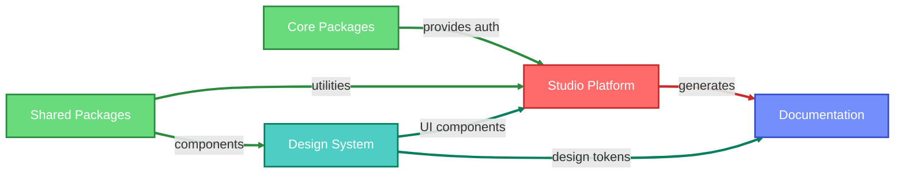
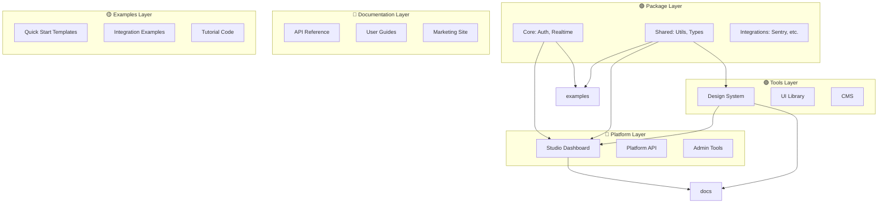

# Supabase Architecture - Colored Visualization

## Directory Structure with Color Coding

```mermaid
graph TD
    %% Define styles for different categories
    classDef platform fill:#FF6B6B,stroke:#C92A2A,stroke-width:2px,color:#fff
    classDef tools fill:#4ECDC4,stroke:#087F5B,stroke-width:2px,color:#fff
    classDef docs fill:#748FFC,stroke:#364FC7,stroke-width:2px,color:#fff
    classDef packages fill:#69DB7C,stroke:#2B8A3E,stroke-width:2px,color:#fff
    classDef examples fill:#FFD43B,stroke:#F08C00,stroke-width:2px,color:#212529
    classDef infrastructure fill:#868E96,stroke:#343A40,stroke-width:2px,color:#fff
    classDef internal fill:#F783AC,stroke:#A61E4D,stroke-width:2px,color:#fff
    classDef blocks fill:#CC5DE8,stroke:#862E9C,stroke-width:2px,color:#fff

    %% Root node
    supabase[Supabase Root]:::root

    %% Platform (Red) - Core production applications
    platform[Platform]:::platform
    studio[Studio Dashboard]:::platform
    api[Platform API]:::platform
    admin[Admin Tools]:::platform

    %% Tools (Teal) - Development and design utilities
    tools[Tools]:::tools
    designSystem[Design System]:::tools
    uiLibrary[UI Library]:::tools
    cms[CMS]:::tools

    %% Docs (Blue) - Documentation sites
    docs[Documentation]:::docs
    reference[API Reference]:::docs
    guides[User Guides]:::docs
    www[Marketing Site]:::docs

    %% Packages (Green) - Shared libraries
    packages[Packages]:::packages
    core[Core Packages]:::packages
    shared[Shared Utils]:::packages
    integrations[Integrations]:::packages

    %% Examples (Yellow) - Example applications
    examples[Examples]:::examples
    starters[Starters]:::examples
    integrationsExamples[Integrations]:::examples
    tutorials[Tutorials]:::examples

    %% Infrastructure (Gray) - DevOps and deployment
    infrastructure[Infrastructure]:::infrastructure
    docker[Docker]:::infrastructure
    github[GitHub Actions]:::infrastructure
    testing[Testing/E2E]:::infrastructure

    %% Internal (Pink) - Internal tools
    internal[Internal]:::internal
    scripts[Scripts]:::internal
    generators[Generators]:::internal
    linting[Linting]:::internal

    %% Blocks (Purple) - Reusable UI blocks
    blocks[UI Blocks]:::blocks
    vue[Vue Components]:::blocks

    %% Connections with colored edges
    supabase --> platform
    supabase --> tools
    supabase --> docs
    supabase --> packages
    supabase --> examples
    supabase --> infrastructure
    supabase --> internal
    supabase --> blocks

    %% Platform connections
    platform --> studio
    platform --> api
    platform --> admin

    %% Tools connections
    tools --> designSystem
    tools --> uiLibrary
    tools --> cms

    %% Docs connections
    docs --> reference
    docs --> guides
    docs --> www

    %% Packages connections
    packages --> core
    packages --> shared
    packages --> integrations

    %% Examples connections
    examples --> starters
    examples --> integrationsExamples
    examples --> tutorials

    %% Infrastructure connections
    infrastructure --> docker
    infrastructure --> github
    infrastructure --> testing

    %% Internal connections
    internal --> scripts
    internal --> generators
    internal --> linting

    %% Blocks connections
    blocks --> vue

    %% Define root style
    classDef root fill:#212529,stroke:#000,stroke-width:3px,color:#fff
```

## Color Legend

| Category | Color | Purpose |
|----------|-------|---------|
| **Platform** | 🔴 Red | Core production applications |
| **Tools** | 🟢 Teal | Development and design utilities |
| **Documentation** | 🔵 Blue | Documentation and marketing sites |
| **Packages** | 🟢 Green | Shared libraries and utilities |
| **Examples** | 🟡 Yellow | Example applications and templates |
| **Infrastructure** | ⚫ Gray | DevOps and deployment configurations |
| **Internal** | 🩷 Pink | Internal development tools |
| **UI Blocks** | 🟣 Purple | Reusable UI components |

## Flow Diagram with Dependencies

## Interactive Architecture Map

## Benefits of the Colored Architecture

1. **Visual Clarity**: Colors help distinguish between different types of components
2. **Quick Navigation**: Easily identify which layer a component belongs to
3. **Dependency Flow**: Colored edges show relationships between layers
4. **Mental Model**: Color coding creates a stronger mental map of the architecture
5. **Onboarding**: New contributors can quickly understand the structure

The color scheme follows semantic meaning:
- **Red** for critical production systems
- **Green** for healthy, reusable code
- **Teal** for creative development tools  
- **Blue** for informational content
- **Yellow** for educational examples
- **Gray** for foundational infrastructure
- **Pink** for internal utilities
- **Purple** for reusable components